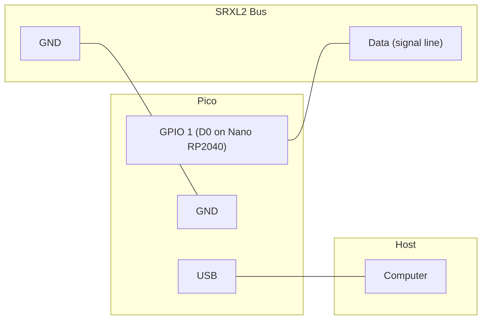
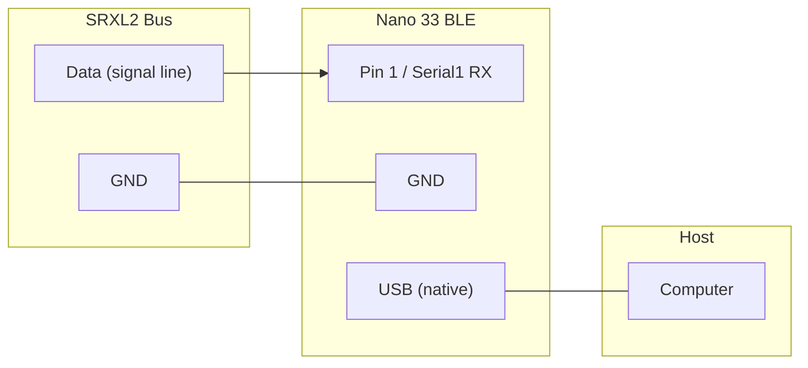
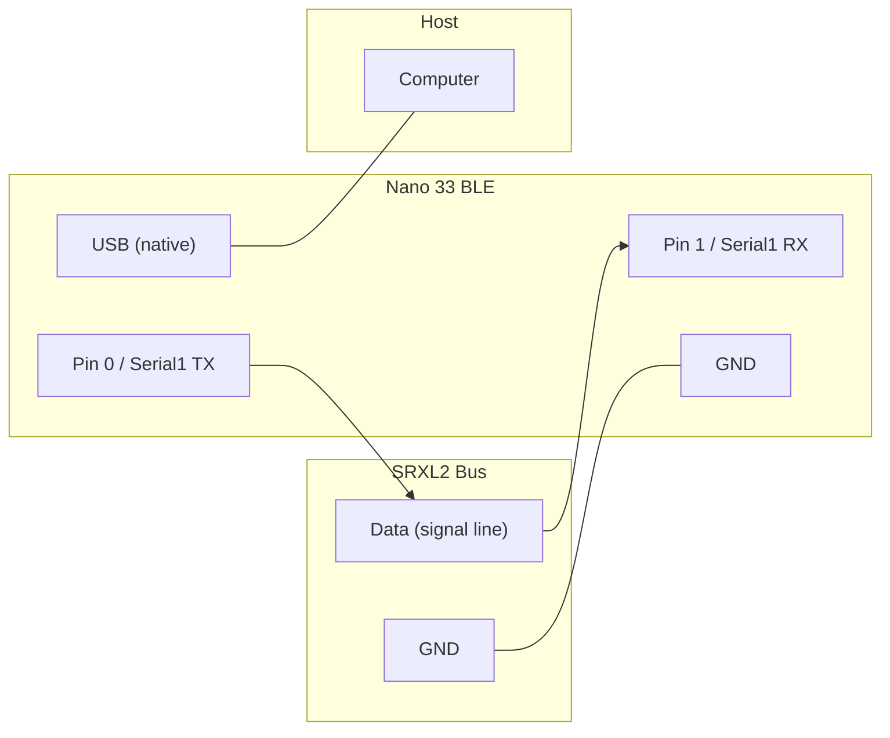

# Embedded SRXL2 Programs

SRXL2 sniffer and bus master for embedded targets. These compile `libsrxl2`
directly -- no OS, no dependencies beyond the vendor SDK.

Each target provides these programs:

| Program | Role | Description |
|---------|------|-------------|
| **sniffer** | Passive | Decodes all bus traffic via PIO UART (RX only) |
| **sniffer_uart** | Passive | HW UART debug variant for wiring verification (Pico only) |
| **master** | Bus master | Runs handshake, sends channels, prints telemetry (TX+RX) |
| **fc** | FC slave | Connects to a receiver, receives channels, sends FC telemetry (TX+RX) |
| **battery** | Battery sensor | Simulates a 4S LiPo, sends FP_MAH telemetry when polled (TX+RX) |

## Raspberry Pi Pico

### Prerequisites

- [Pico SDK](https://github.com/raspberrypi/pico-sdk) installed
- `PICO_SDK_PATH` environment variable set
- `cmake`, `arm-none-eabi-gcc` (with newlib, e.g. `brew install --cask gcc-arm-embedded`)

### Build

```bash
cd embedded/pico
mkdir build && cd build
cmake ..
make -j
```

Produces `sniffer_pico.uf2`, `sniffer_pico_uart.uf2`, `master_pico.uf2`, `fc_pico.uf2`, and `battery_pico.uf2` for drag-drop flashing.

### Flash

Hold BOOTSEL on the Pico, plug in USB, then:

```bash
cp build/sniffer_pico.uf2 /Volumes/RPI-RP2/   # macOS
# or
cp build/master_pico.uf2 /Volumes/RPI-RP2/
# or
cp build/fc_pico.uf2 /Volumes/RPI-RP2/
# or
cp build/battery_pico.uf2 /Volumes/RPI-RP2/
```

### Wiring (all Pico targets -- single wire)

All Pico targets use PIO half-duplex UART on a single GPIO pin. The same
wiring works for the sniffer, master, FC, and battery:



> The PIO UART disables the RX state machine during TX, so there is no echo
> and no guard timer needed. No external open-drain driver is required for
> single-master configurations. The default GPIO is 1 (RX/D0 on Arduino
> Nano RP2040 Connect); override with `-DSRXL2_PIN=<n>` at compile time.
> On a plain Pico, any GPIO works.

### Output (Master)

```
=== SRXL2 Pico Master ===
PIO UART on GPIO 1 @ 115200 baud, single-wire half-duplex
Running...

[M] Handshake done, 1 peer(s)
[T 0xB0] FP: 2.1A 150mAh
[M] state=RUNNING peers=1
```

### Output (FC)

```
=== SRXL2 Pico FC (Slave) ===
Device ID: 0x30 (Flight Controller)
PIO UART on GPIO 1 @ 115200 baud, single-wire half-duplex
Telemetry: FP_MAH (0x34), RPM (0x7E)

Waiting for receiver handshake...

[FC] Handshake done, 1 peer(s)
[FC] CH: 32768 32768 32768 32768  RSSI:100
[FC] state=RUNNING peers=1  22.2V 12.5A 35mAh 15000RPM
```

### Output (Battery)

```
=== SRXL2 Pico Battery Sensor ===
Device ID: 0xB0 (Sensor)
PIO UART on GPIO 1 @ 115200 baud, single-wire half-duplex
Battery: 4S LiPo, 5000 mAh
Telemetry: FP_MAH (0x34)

Waiting for master handshake...

[BAT] Handshake done, 1 peer(s)
[BAT] state=RUNNING peers=1  16.80V 5.00A 0/5000mAh (100.0%) 25.0C
```

### Arduino Nano RP2040 Connect

This board uses the RP2040 chip and works with the same Pico SDK build.
The default GPIO 1 maps to the RX/D0 pin on this board.

```bash
cd embedded/pico
mkdir build && cd build
cmake .. -DPICO_BOARD=arduino_nano_rp2040_connect
make -j
```

Flash with `picotool` (install via `brew install picotool`):

```bash
picotool reboot -f -u                     # force into BOOTSEL mode
picotool load build/fc_pico.uf2 -f        # flash and auto-reboot
```

The USB CDC serial port appears as `/dev/cu.usbmodem*` on macOS.

## Arduino Nano 33 BLE (Rev2)

nRF52840-based board with native USB + separate hardware UART.

### Prerequisites

- [arduino-cli](https://arduino.github.io/arduino-cli/)
- Arduino Mbed Nano core

```bash
# macOS
brew install arduino-cli
arduino-cli core install arduino:mbed_nano
```

### Build

```bash
cd embedded/arduino
make              # builds sniffer, master, and fc
make sniffer      # sniffer only
make master       # master only
make fc           # flight controller only
```

### Flash

```bash
make flash-sniffer PORT=/dev/ttyACM0
# or
make flash-master  PORT=/dev/ttyACM0
# or
make flash-fc      PORT=/dev/ttyACM0
```

### Wiring (Sniffer -- RX only)



### Wiring (Master -- TX+RX, half-duplex)



### Output (Master)

```
=== SRXL2 Nano 33 BLE Master ===
Serial1 (pins 0/1) @ 115200, half-duplex
Running...

[M] Handshake done, 1 peer(s)
[T 0xB0] FP: 2.1A 150mAh
[M] state=RUNNING peers=1
```

### Output (FC)

```
=== SRXL2 Nano 33 BLE FC (Slave) ===
Device ID: 0x30 (Flight Controller)
Serial1 (pins 0/1) @ 115200, half-duplex
Telemetry: FP_MAH (0x34), RPM (0x7E)

[FC] Handshake done, 1 peer(s)
[FC] CH: 32768 32768 32768 32768 RSSI:-50
[FC] state=RUNNING peers=1  22.2V 12.5A 35mAh 15000RPM
```

## Memory Usage

| Target | Program | Flash | RAM |
|--------|---------|-------|-----|
| Pico (RP2040) | sniffer | ~80KB | ~8KB |
| Pico (RP2040) | master | ~90KB | ~10KB |
| Pico (RP2040) | fc | ~85KB | ~10KB |
| Pico (RP2040) | battery | ~85KB | ~10KB |
| Nano 33 BLE (nRF52840) | sniffer | ~90KB (9%) | ~45KB (17%) |
| Nano 33 BLE (nRF52840) | master | ~92KB (9%) | ~46KB (17%) |

## Limitations

- Sniffer is receive-only (passive) -- does not participate in the bus
- Master sends 16 channels at center (32768) -- intended for telemetry testing,
  not for actual RC control
- Fixed at 115200 baud (no baud negotiation to 400000)
- Arduino targets use hardware UART with echo guard; Pico targets use
  PIO half-duplex (no echo issue)
- PIO pindir fix: the TX state machine's pin direction is reset to input
  after init and after each send, since PIO pin directions are OR'd across
  state machines (without this fix, the pin stays driven and RX cannot read)
