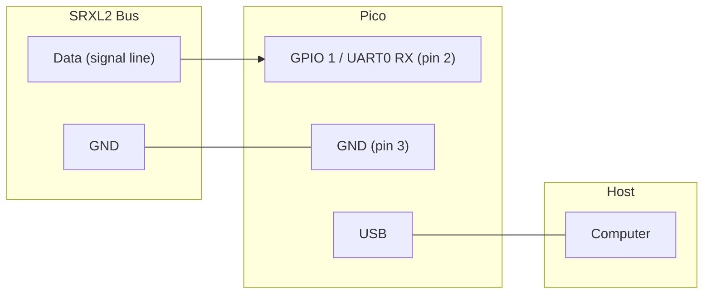
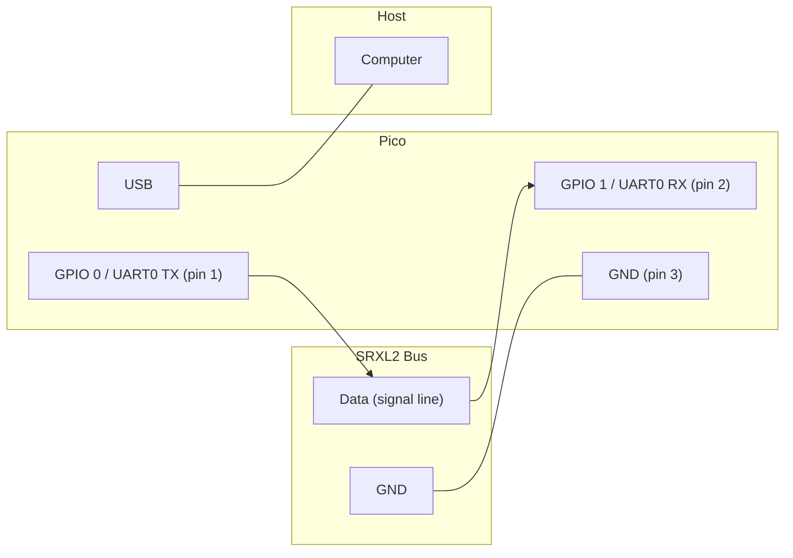
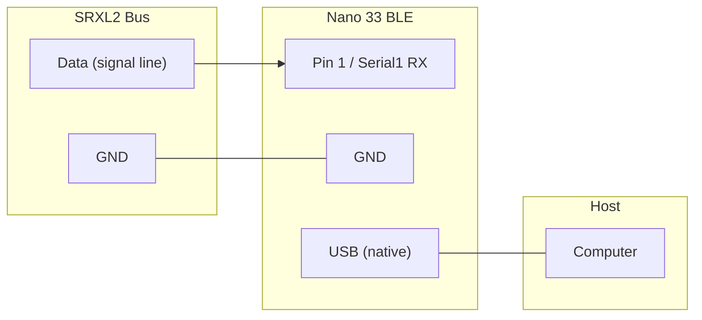
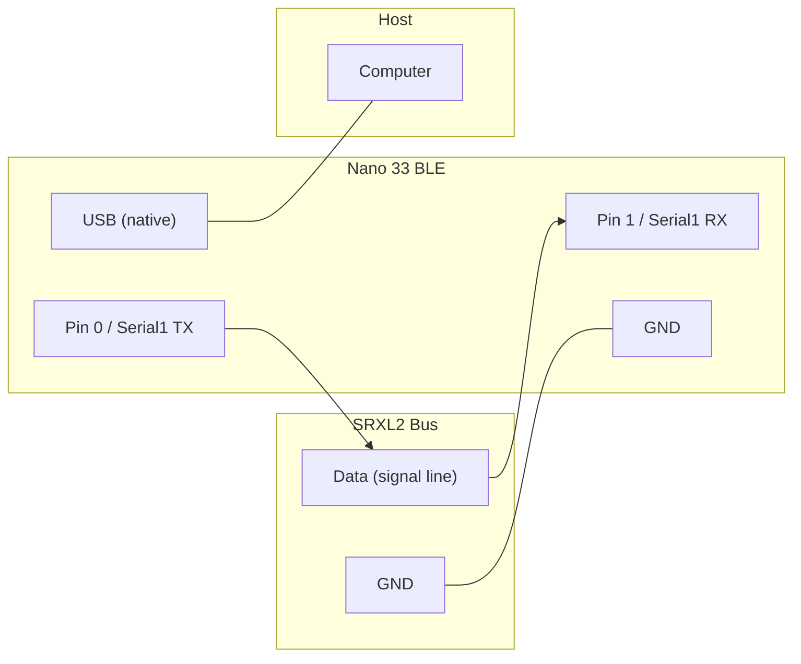

# Embedded SRXL2 Programs

SRXL2 sniffer and bus master for embedded targets. These compile `libsrxl2`
directly -- no OS, no dependencies beyond the vendor SDK.

Each target provides three programs:

| Program | Role | Description |
|---------|------|-------------|
| **sniffer** | Passive | Decodes all bus traffic (RX only) |
| **master** | Bus master | Runs handshake, sends channels, prints telemetry (TX+RX) |
| **fc** | FC slave | Connects to a receiver, receives channels, sends FC telemetry (TX+RX) |

## Raspberry Pi Pico

### Prerequisites

- [Pico SDK](https://github.com/raspberrypi/pico-sdk) installed
- `PICO_SDK_PATH` environment variable set
- `cmake`, `arm-none-eabi-gcc` (with newlib, e.g. `brew install --cask gcc-arm-embedded`)

### Build

```bash
cd embedded/pico
mkdir build && cd build
cmake ..
make -j
```

Produces `sniffer_pico.uf2`, `master_pico.uf2`, and `fc_pico.uf2` for drag-drop flashing.

### Flash

Hold BOOTSEL on the Pico, plug in USB, then:

```bash
cp build/sniffer_pico.uf2 /Volumes/RPI-RP2/   # macOS
# or
cp build/master_pico.uf2 /Volumes/RPI-RP2/
# or
cp build/fc_pico.uf2 /Volumes/RPI-RP2/
```

### Wiring (Sniffer -- RX only)



### Wiring (Master -- TX+RX, half-duplex)



> Half-duplex: both TX and RX connect to the same bus wire. Use an open-drain
> driver or diode-OR if the bus has multiple transmitters. The master filters
> its own echo using a timing guard after each transmit.

### Output (Master)

```
=== SRXL2 Pico Master ===
UART0 (GPIO 0/1) @ 115200, half-duplex
Running...

[M] Handshake done, 1 peer(s)
[T 0xB0] FP: 2.1A 150mAh
[M] state=RUNNING peers=1
[T 0xB0] FP: 2.2A 151mAh
```

### Output (FC)

```
=== SRXL2 Pico FC (Slave) ===
Device ID: 0x30 (Flight Controller)
UART0 (GPIO 0/1) @ 115200, half-duplex
Telemetry: FP_MAH (0x34), RPM (0x7E)

Waiting for receiver handshake...

[FC] Handshake done, 1 peer(s)
[FC] CH: 32768 32768 32768 32768  RSSI:-50
[FC] state=RUNNING peers=1  22.2V 12.5A 35mAh 15000RPM
```

> The FC wiring is the same as the Master (TX+RX half-duplex). Connect the FC
> to a Spektrum SRXL2 receiver's data line. The receiver acts as bus master.

## Arduino Nano 33 BLE (Rev2)

nRF52840-based board with native USB + separate hardware UART.

### Prerequisites

- [arduino-cli](https://arduino.github.io/arduino-cli/)
- Arduino Mbed Nano core

```bash
# macOS
brew install arduino-cli
arduino-cli core install arduino:mbed_nano
```

### Build

```bash
cd embedded/arduino
make              # builds sniffer, master, and fc
make sniffer      # sniffer only
make master       # master only
make fc           # flight controller only
```

### Flash

```bash
make flash-sniffer PORT=/dev/ttyACM0
# or
make flash-master  PORT=/dev/ttyACM0
# or
make flash-fc      PORT=/dev/ttyACM0
```

### Wiring (Sniffer -- RX only)



### Wiring (Master -- TX+RX, half-duplex)



### Output (Master)

```
=== SRXL2 Nano 33 BLE Master ===
Serial1 (pins 0/1) @ 115200, half-duplex
Running...

[M] Handshake done, 1 peer(s)
[T 0xB0] FP: 2.1A 150mAh
[M] state=RUNNING peers=1
```

### Output (FC)

```
=== SRXL2 Nano 33 BLE FC (Slave) ===
Device ID: 0x30 (Flight Controller)
Serial1 (pins 0/1) @ 115200, half-duplex
Telemetry: FP_MAH (0x34), RPM (0x7E)

[FC] Handshake done, 1 peer(s)
[FC] CH: 32768 32768 32768 32768 RSSI:-50
[FC] state=RUNNING peers=1  22.2V 12.5A 35mAh 15000RPM
```

## Memory Usage

| Target | Program | Flash | RAM |
|--------|---------|-------|-----|
| Pico (RP2040) | sniffer | ~75KB | ~8KB |
| Pico (RP2040) | master | ~85KB | ~10KB |
| Nano 33 BLE (nRF52840) | sniffer | ~90KB (9%) | ~45KB (17%) |
| Nano 33 BLE (nRF52840) | master | ~92KB (9%) | ~46KB (17%) |

## Limitations

- Sniffer is receive-only (passive) -- does not participate in the bus
- Master sends 16 channels at center (32768) -- intended for telemetry testing,
  not for actual RC control
- Fixed at 115200 baud (no baud negotiation to 400000)
- Echo suppression uses a timing guard (~2ms) which may need tuning on real hardware
